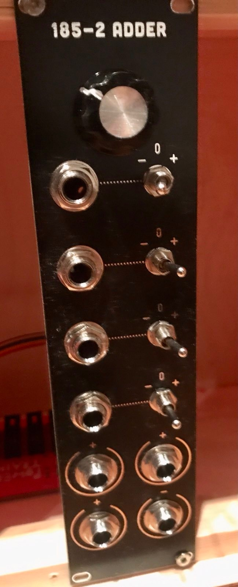

Precision adder based on [Doepfer A185-2](https://doepfer.de/a1852.htm) in KOSMO format.

You can use precision opamps, but I found that simple TL074 also work.
I could not get the 1V reference voltage to be exactly 1V, maybe my regulator was not great or my resitors were a bit off. 
I would suggest to use not 100 ohms for that, but maybe 500? 

